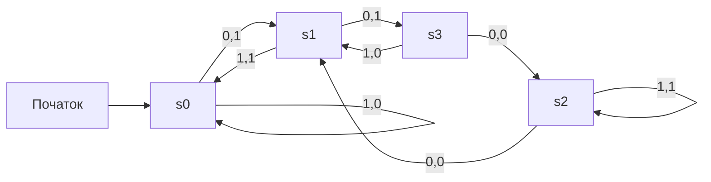
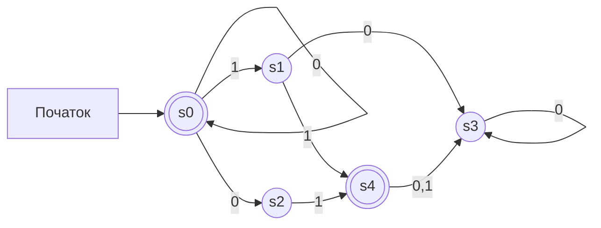

# Означення

## Автомати
*Скінченний автомат* - $M = (S, I, O, f, g, s_0)$
$S$ - *множина станів*
$I$ - *вхідний алфавіт*
$O$ - *вихідний алфавіт*
$S, I, O$ - скінченні множини

$f: S \times I \to S$ - *функція переходів*
Для якогось вхідного символу за теперішнім станом переходить в інший стан

$g: S \times I \to O$ - *функція виходів*
Для якогось вхідного символу за теперішнім станом видає, який вихідний символ може бути

$s_0 \in S$ - *початковий стан*

*Таблиця станів* - таблиця, яка показує всі перетворення
Приклад:

| Стан  | f     |       | g    |   |
|-------|-------|-------|------|---|
|       | Вхід  |       | Вхід |   |
|       | 0     | 1     | 0    | 1 |
| $s_0$ | $s_1$ | $s_0$ | 1    | 0 |
| $s_1$ | $s_3$ | $s_0$ | 1    | 1 |
| $s_2$ | $s_1$ | $s_2$ | 0    | 1 |
| $s_3$ | $s_2$ | $s_1$ | 0    | 0 |

*Діаграма станів* - ще один спосіб презентування

Вхідний рядок $\alpha=101$ перетвориться:
- В $s_0$:
    - $1 \to s_0$
    - $1 \to 0$
- В $s_0$:
    - $0 \to s_1$
    - $0 \to 1$
- В $s_1$:
    - $1 \to s_0$
    - $1 \to 1$
Отже, $\omega = 011$ - вихідний рядок

*Скінченний автомат без виходу* - $M = (S, I, f, s_0, F)$

$S$ - *множина станів*
$I$ - *вхідний алфавіт*
$f: S \times I \to S$ - *функція переходів*
$s_0 \in S$ - *початковий стан*
$F \subseteq S$ - *множина заключних станів*. На діаграмах позначають подвійними обведеннями

Тут нема на кожному кроці виходу, а є тільки множина заключних станів:
якщо в них переходить, то вихід усього рядка - 1, якщо ні - 0

*Недетермінований* скінченний автомат без виходу - кожному $(s, i)$ може відповідати множина наступних станів(може й нуль)
Наприклад:

| Стан  | f          |       |
|-------|------------|-------|
|       | Вхід       |       |
|       | 0          | 1     |
| $s_0$ | $s_0, s_2$ | $s_1$ |
| $s_1$ | $s_3$      | $s_4$ |
| $s_2$ | -          | $s_4$ |
| $s_3$ | $s_3$      | -     |
| $s_4$ | $s_3$      | $s_3$ |

*Діаграма станів*:

## Подання мов

*Конкатенація множин* $AB$ - всі можливі поєднання $\alpha\beta$, де $\alpha \in A, \beta \in B$

*Замикання Кліні* - множина всіх можливих ланцюжків, які можна отримати з конкатенацій усіх можливих кількостей ланцюжків з A
$\displaystyle A^* = \bigcup_{k = 0}^{\infty} A^k$

*Регулярний вираз* над множиною $I$ - рекурсивно визначається:
- $\varnothing$ - порожня множина
- $\lambda$ - порожній ланцюжок
- $x$ - регулярний, якщо $x \in I$
- $(AB), (A \cup B), (A^*)$ - регулярні, якщо $A, B$ - регулярні

*Регулярна множина* - множина, яка може бути описана регулярним виразом

Регулярними виразами можна описати мови типу 3(регулярні). Для інших треба щось складніше

*Проблема мови* - перевірка, чи щось належить мові

### Позначення

| Вираз          | Що означає                                             |
|----------------|--------------------------------------------------------|
| $10*$          | 1, після цього довільна кількість 0(або нема нулів)    |
| $(10)*$        | довільна кількість 10(або нема)                        |
| $0 \cup 01$    | 0 та 01                                                |
| $0(0 \cup 1)*$ | Довільний ланцюжок, що починається з нуля              |
| $(0*1)*$       | Довільний ланцюжок, що закінчується на 1(або порожній) |

# Теореми

## Теорема 1
Якщо мова $L$ розпізнається недетермінованим автоматом $M_0$, то існує й детермінований $M_1$, що розпізнає її

## Теорема Кліні
Множина регулярна $\Leftrightarrow$ її може розпізнавати скінченний автомат

## Теорема 2
Регулярною граматикою породжується регулярна множина, й лише вона

## Теорема 3
Мова регулярна $\Leftrightarrow$ її можна описати регулярним виразом

## Лема про накачування для регулярних мов
Нехай $L$ - регулярна. $\exists n$(залежить від $L$)$(\forall \alpha \in L)(|\alpha| \ge N)$:
Можна розбити $\alpha$ на три частини $\alpha = \beta \gamma \omega$, так що:
1. $\gamma \not= \lambda$
2. $|\beta \gamma| \le n$
3. $\forall k \ge 0: \beta \gamma^k\omega \in L$

Тобто десь біля початку $\alpha$ можна знайти таку послідовність $\gamma$, що замикається, і її можна повторити скільки хочеш разів(0 теж можна)

## Лема про накачування для контекстно вільних мов
Нехай $L$ - контекстно вільна. $(\exists n)(\forall \alpha \in L)(|\alpha| \ge n)$:
Можна розбити $\alpha$ на п'ять частин $\alpha = \beta \gamma \omega \delta \eta$, так що:
1. $|\gamma \omega \delta | \le n$
2. $\gamma \delta \not = \lambda$
3. $\forall k: \beta \gamma^k\omega\delta^k\eta \in L$

Тут уже у двох місцях можна накачувати одночасно
