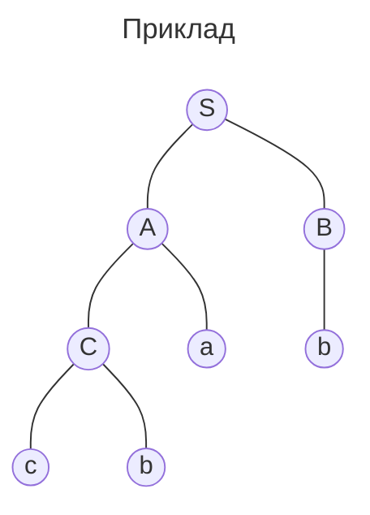
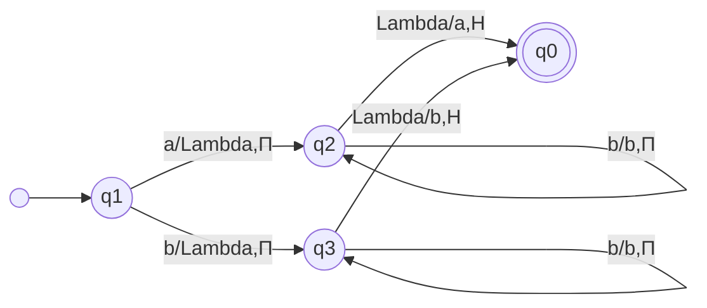

# Означення
*Буква* - простий неподільний знак
*Алфавіт* $V$ - множина букв

*Ланцюжок(або слово)*(string) - впорядкована сукупність букв алфавіту
Ланцюжки позначають як $a_1a_2...a_n$
*Порожній* - $\lambda$
Множина ланцюжків довжини $n$ - $\underbrace{V \times V \times ... \times V}_{n}$
Множина всіх ланцюжків $\displaystyle V^* = V^0 \cup V^1 \cup ... = \bigcup_{i = 0}^\infty  V^i$ - замикання $V$

*"Піднесення до степеня"*:
$a^0 = \lambda$
$a^2 = aa$
...

**Інший набір означень**:
Коли під буквами(простими неподільними знаками) вважають уже цілі слова(зі звичайної мови)
Тобто все так само працюють, просто неподільні знаки(у цьому випадку це *слова*) довгі, і з них складають *речення*
**Важлива ремарка**: при звичних означеннях слово - сукупність букв, а тут слово - будівельний блок для речень(те, що звично називають словом)
*Словник* - те, що було алфавітом

*Мова* - множина ланцюжків(або речень). Не обов'язково всіх слів(скоріше навпаки, частина всіх можливих комбінацій, бо більшість комбінацій не мають сенсу)
Мова $L \subset V^*$
*Синтаксис* - правила, що визначають множину речень. Їх легше описати
*Семантика* - опис множини змістів, відповідність змістів і речень

Треба якось описувати мови, без того, щоб перераховувати всі слова
*Граматика* - формальний спосіб опису мови
$G = (V, T, S, P)$
$V$ - *алфавіт*(словник)
$T$ - *термінальні*(основні) символи по суті це елементи $V$
$S$ - *початковий* символ. З нього правилами виведення будуть виводитися всі інші символи
$P$ - множина *продукцій*(правил перетворення) вигляду $\xi \to \eta$, де $\xi, \eta \in V$
$N = V \backslash T$ - *нетермінальні*(допоміжні) символи. Вони групують інші символи, а самі значення не мають
До прикладу $A$ може складатися з $Ba$ - ще іншого нетермінального й одного термінального символа
Також можуть бути виведення типу $Aa \to aba$ та $A \to cc$. Тоді $A$ загалом можна замінити на $cc$, а в ситуації перед $a$ як на $cc$, так і на $ab$

*Прийнято* позначати:
- Нетермінальні символи великими літерами
- Термінальні - маленькими чи цифрами
- Ланцюжки - грецькими буквами

Також є виведення слів:
Якщо $\alpha_0 = \sigma\xi\tau, \alpha_1 = \sigma\eta\tau$ ($\xi \not= \lambda$), то $\alpha_1$ *безпосередньо виводиться* з $\alpha_0$: $\alpha_0 \Rightarrow \alpha_1$

Якщо $\alpha_0 \Rightarrow \alpha_1 \Rightarrow ... \Rightarrow \alpha_n$, то $\alpha_n$ *виводиться* з $\alpha_0$: $\alpha_0 \overset{*}{\Rightarrow} \alpha_n$
*Виведення* - послідовність кроків між $\alpha_0$ та $\alpha_n$

*Мова, породжена $G$* - всі ланцюжки терміналів(тобто тільки те, що має сенс) + порожнє слово, що виводяться з $S$
$L(G) = \l\{ \omega \in T^* \mid S \overset{*}{\Rightarrow} \omega \r\}$

**Приклад мови**:
$V = \{S, A, a, b\}$
$T = \{a, b\}$
$P = \{ S \to aA, S \to b, A \to aa \}$
Можна вивести:
$S \overset{*}{\Rightarrow} aA \overset{*}{\Rightarrow} aaa$
або
$S \overset{*}{\Rightarrow} b$
Отже, $L(G) = \{b, aaa\}$

## Типи граматик
$\xi \to \eta$:
*0.* Нема обмежень 
*1.* $\l| \xi \r| \le \l| \eta \r|$ або $\eta = \lambda$
*2.* $\xi = A$ - нетермінальний символ
*3.* $\xi = A$ та ($\eta = aB$ або $\eta = a$) або $S \to \lambda$. Тобто розширюватися може тільки в один бік(у нашому випадку правостороння, але є ще лівостороння, коли $\eta = Ba$ або $\eta = a$ в дужках)

$3 \subset 2 \subset 1 \subset 0$

1 - *контекстно залежні*, бо можуть бути моменту типу $\gamma\mu\delta \to \gamma\nu\delta$, де тільки в контексті $\gamma$ і $\delta$ може статися заміна
2 - *контекстно вільні*, бо нема якихось обмежень, в якому контексті $\xi$ може бути замінене
3 - *регулярні*

## Дерева виведення
Контекстно вільні граматики можна представити у вигляді дерева виведення

Якщо щось вивести можна кількома способами(є кілька дерев виведення) - граматика *неоднозначна*

## Форми Бекуса-Наура
Також контекстно вільні граматики можна зображати *у вигляді форм Бекуса-Наура*
$\langle A \rangle ::= \alpha_1 | \alpha_2 | ... | \alpha_n$

Зліва нетермінал
Справа всі варіанти, у що він може перетворитися

Наприклад:
$\langle A \rangle ::= \langle A \rangle a | a | \langle A \rangle \langle B \rangle$

# ![[Скінченні автомати]]

# Машина Тюрінга
Складається зі нескінченної *стрічки*(що складається з комірок), *ПК*(пристрою керування) та *Г*(головки читання-запису)

*Алфавіт зовнішніх символів*(зовнішній алфавіт) $A$ - символи, що можуть бути записані на стрічці. Серед них має бути $\Lambda$ - порожній
*Алфавіт внутрішніх станів* $Q = \l\{q_0, q_1, ..., q_k \r\}$ - 

## Хід роботи
Спочатку головка на якомусь символі
Ми можемо зчитувати, під чим вона, змінювати цей символ та пересуватися вліво чи вправо(чи не рухатися)

У нас є внутрішні стани, для кожного визначено, що робити для певних значень під головкою
Щоб змінювати, що робити при тих самих значеннях під головкою, треба змінювати стан

До прикладу:
$q_0: a \to b, П, q_1$
$q_0: b \to a, П, q_1$
$q_0: \Lambda \to \Lambda, П, q_1$
$q_1: a \to a, П, q_0$
$q_1: b \to b, П, q_0$
$q_1: \Lambda \to \Lambda, Н, q_f$
Тут, коли початковий стан $q_0$, змінюється символ на протилежний, а стан переходить в $q_1$. Також головка рухається вправо
А в $q_1$ символ лишається, і переходить в $q_0$. А все закінчується, коли трапляється в $q_1$ $\Lambda$(перехід до $q_f$)
Тобто змінюється кожен другий символ

В літературі переважно $q_0$ - початковий, а кінцевий - $q_f$

У лекції $q_1$ - початковий, а $q_0$ - кінцевий

## Формально Машина Тюрінга
$M = \l( A, Q, q_0, q_1, \Lambda, \delta \r)$
$A, Q$ - зовнішній та внутрішній алфавіти(символи на стрічці та стани)
$q_0$ - заключний стан
$q_1$ - початковий стан ==| Знову ж таки, в літературі переважно $q_0$ - початковий, а $q_f$ - кінцевий==
$\Lambda$ - порожній символ
$\delta$ - функція переходів

Переходи:
$q_ia_i \to a_jDq_j$
$\delta: Q\backslash\l\{ q_0 \r\} \times A \to A \times \l\{ П, Л, Н \r\} \times Q$
$П$ - право
$Л$ - ліво
$Н$ - нічого

Переходи можна зобразити таблицею:

|       | $\Lambda$ | a               | b               |
|-------|-----------|-----------------|-----------------|
| $q_1$ | -         | $\Lambda$П$q_2$ | $\Lambda$П$q_3$ |
| $q_2$ | aН$q_0$   | aП$q_2$         | bП$q_2$         |
| $q_3$ | bН$q_0$   | aП$q_3$         | bП$q_3$         |

Прочерк означає, що такого в теорії не мало би траплятися, тому там не заморочувалися
Якщо якось стає так, що неможливо досягнути $q_0$(виходу нема), то машина *незастосовна* ддо такого рядка

## Орієнтований граф

## Числові функції
Числа зображають як відповідну кількість одиниць + 1
Тобто $0$ - $1$
$1$ - $11$
$2$ - $111$
...

Щоб кілька чисел записати, треба між ними поставити $\Lambda$

Числова функція *обчислювальна за Тюрінгом* - якщо можна знайти машину Тюрінга, яка б її порахувала

## Теза Тюрінга
Будь-який алгоритм можна реалізувати машиною Тюрінга

Довести не можна, бо поняття алгоритму інтуїтивне

## Нерозв'язні проблеми
1. Проблема самозастосовності
Самозастосовна - якщо репрезентувати машину як стрічку, то ця машина може обробити цю стрічку(застосона до неї)
Не можна визначити алгоритмічно, чи є машина самозастосовною
2. Проблема зупинки
Не можна визначити алгоритмічно, чи видасть машина результат, чи буде працювати безкінечно
3. Не можна 100% перевірити, чи тотожно істинна формула логіки предикатів
